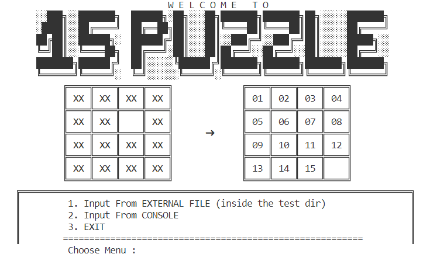

# 15-Puzzle Solver
> Welcome to the 15-Puzzle solver repository!
This repository is made in order to fulfill the third **Tugas Kecil Mata Kuliah IF2211 Strategi Algoritma**. The Branch and Bound algorithm is implemented to solve the 15-Puzzle.

## Creator
Rania Dwi Fadhilah - 13520142 (K1)

## Overview


## Usage

### Dependencies
- [Python](https://www.python.org/downloads/)
- Library : After cloning the repository, open the CMD from the repo and type 
  ```
  pip install -r src/requirements.txt
  ```

### Program Installation
Clone the repository to the laptop local repository.
```
git clone https://github.com/raniadf/15puzzle.git
```

### Program Execution
1. Open the 'Tucil3_1520142' folder
2. Open CMD, and type
   ```
   cd src
   Python main.py
   ```
3. Pick which input you want to use
4. If 1, make sure that the file is inside the test folder
5. Program will find it's way to SOOOOLVEEE your puzzle!
